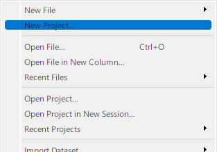
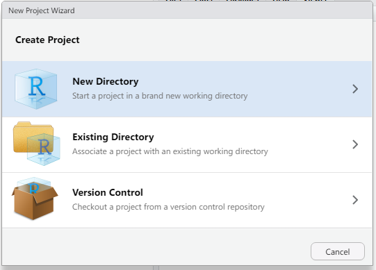
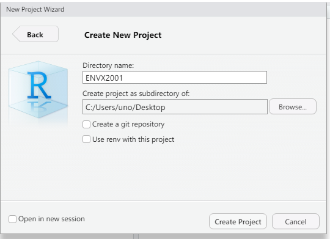
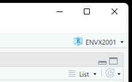

```{r setup, include=FALSE}
library(learnr)
knitr::opts_chunk$set(echo = FALSE)
```


## Welcome
### Outline


Welcome to Tutorial 1. In this tutorial we will show you:

- How to set up a project in RStudio
- Create and R Markdown file on RStudio
- Perform quick exploratory analysis in R

It is highly recommended that you complete this tutorial before this week's Lab.


## Setting up a project in RStudio

Organise yourself for ENVX2001 by creating an ENVX2001 project (`.Rproj` extension). Follow the steps below to create this file so that RStudio recognises your working folder.

### Step 1

Select `File` > `New Project...` from the menu bar that is at the top of your screen (macOS) or the top of RStudio.




### Step 2

Create project by selecting a `New Directory`. You may also use an `Existing Directory` if you know what you are doing.



### Step 3

In the next window, Sst `Directory name` to "ENVX2001" or similar, and click on `Browse` to select the folder where this folder will reside, e.g. the Desktop. Click on `Create Project` when ready.



### Step 4

Verify that the project is created by looking at the top right corner of RStudio. Your project should have automatically opened and you will see the project name as "ENVX2001".



### Why did I create a project?

- You have basically created a file, `ENVX2001.Rproj`, which now resides in the folder "ENVX2001".
- When you open this file, RStudio will set the **working directory** to the folder that contains this `.Rproj` file.
- We can import data easily when the working directory is identified. [See this link for more details](https://support.rstudio.com/hc/en-us/articles/200526207-Using-RStudio-Projects).

**It is recommended that you open the `.Rproj` file every time you work in the Labs, as it will make all data import code reproducible.**


## Create an R Markdown file

In Module 1, we are testing a **new tutorial format** which should make learning in Labs more organised. 
Labs are deployed through `learnr`, a special interactive document in R Markdown (like this file).

